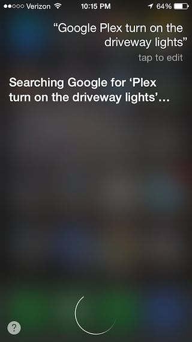
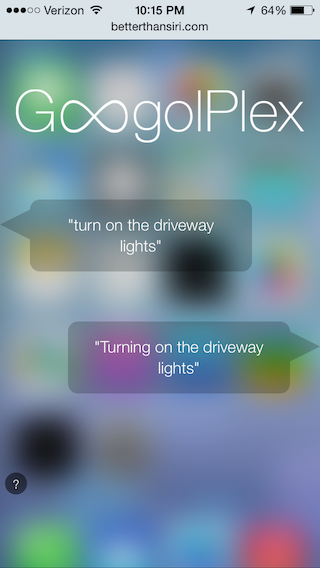

# ZWave Siri

Control your ZWave devices with Siri without a Jailbreak.

## Usage
Tell Siri:

Spoken Command | Sinatra Request 
---------------|---------
Googolplex turn on the driveway lights | GET /lights/driveway/on
Googleplex turn on the master bedroom lights | GET /lights/master%20%bedroom/on
Googleplex turn off the driveway lights | GET /lights/driveway/off

Note: the name of the lights will match the name you use to setup your ZWave lights in your MiCasaVerde Controller (VeraLite)

## Requirements
* A MiCasaVerde controller (only tested on VeraLite)
* Some ZWave light switches
* A computer on the same LAN as the MiCasaVerde controller (with a static IP, recommended)
* A free DuckDNS account with a custom domain name
* Port Forwarding on your wireless router
* An account at betterthansiri.com
* Ruby gems: stringio, sinatra, mios

## Summary
Begin by cloning this repo: `git clone git@github.com:brock/zwave-siri.git`

### DNS
* If you do not already have a dynamic DNS account, register for a free account at http://duckdns.org 
* Open up your router and forward port 80 to the static IP where you'll run this repo and make the destination port 20559 (this is the default port that [Pow](http://pow.cx) uses, which we'll setup below)

### BetterThanSiri
* Follow the instructions at betterthansiri.com to create an account. 
* Once this is setup, navigate to http://betterthansiri.com/panel/main/commands/ and click "Add a New Siri Command".
* Create a Phrase Matcher of "turn ~ the ~ lights"
* Paste the contents of `betterthansiri.js` into the JavaScript text box, replacing YOUR.DYNDNS.ORG with your custom DuckDNS address, and click Save Siri Command.

### Configuring the App
You'll need to know the IP address of your MiCasaVerde Controller before you can start this app.
* Using the LAN IP address for your MiCasaVerde Controller, update `index.rb` with your LAN IP: `mios = MiOS::Interface.new('http://10.0.1.1:3480')` (port 3480 is the default)

You'll want to run this app all the time, and the easiest way to do that is by using http://pow.cx 
Install pow by running the following:
*  `curl get.pow.cx | sh`
*  `cd ~/.pow`
* `ln -s /path/to/zwave-siri`

This sets up http://zwave-siri.dev so that locally you can view the Sinatra app that will talk to your MiCasaVerde Controller. Pow routes all incoming traffic from port 80 to port 20559 by default, so if you are already using port 80, you'll want to modify the above instructions. It is worth mentioning that you don't *have* to use port 80. You could always specify an alternate port in the `betterthansiri.js` file that you use at http://betterthansiri.com. In that case, you'd just need to update your port forwarding and pow settings.

	By default, pow won't respond to requests at your duckdns.org address, it will only respond to zwave-siri.dev, but you can catch all incoming traffic by creating a default pow route:
* `ln -s /path/to/zwave-siri default`

Now try turning on a light by going to the address in your browser:  
http://zwave-siri.dev/lights/driveway/on  
http://YOUR.DUCKDNS.ORG/lights/driveway/on  

If those work, you're ready to try it out using Siri:

	Googolplex turn on the driveway lights

Siri should tell you that she is going to do a Google search for "Plex turn on the driveway lights" which should route directly to the betterthansiri.com webpage. You will have to log in the first time, and you might have to try it again.

## Recommendations / Warnings
The major downside to this whole idea is that betterthansiri.com is completely unsecured. No ssl or anything. The only way for this to work is by setting up a proxy on your iPhone when you are on a wifi hotspot to route ALL your traffic through their servers. 

While this is a really fun project, and works very well, I'd recommend that you create a separate wifi hotspot on your network with a different name, and only connect to that wifi hotspot when you are playing around with this. I'd like to see betterthansiri.com at least get SSL, but you're still routing all of your wifi traffic through a proxy, which has no guarantee of security or speed.

## Credits / Sources
* [BetterThanSiri](http://betterthansiri.com)
* The [MIOS](https://github.com/kreynolds/ruby-mios) Ruby gem
* [DuckDNS](http://duckdns.org)
* [Sinatra](http://sinatrarb.com)
